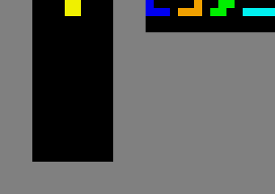

# Tetris RL

This project is a reinforcement learning agent that learns to play Tetris.

## Description

The agent is a Deep Q-Network (DQN) that takes the game state as input and outputs the best action to take. The game state is represented by a stack of four 24x18 tensors:
- The current board
- The queue of upcoming pieces
- The piece in the holder
- The active tetromino mask

## Technologies Used

*   **Python**
*   **PyTorch**: Deep learning framework for building and training the DQN.
*   **Gymnasium**: Reinforcement learning environment for Tetris.
*   **NumPy**: Numerical computing library.
*   **Imageio**: For generating GIF visualizations of gameplay.
*   **Docker**: Containerization for reproducible environments and deployment.
*   **GitHub Actions**: Continuous Integration (CI) for automated testing.

## Installation

To run the project, you need to have Python 3 installed. Then, install the required dependencies:

```bash
pip install -r requirements.txt
```

## Usage

To train the agent, run the following command:
```bash
python train.py
```

To watch the trained agent play and generate a GIF, run:
```bash
python play.py
```

## How to Run with Docker

To build the Docker image:
```bash
docker build -t tetris-rl .
```

To run the training within a Docker container:
```bash
docker run tetris-rl
```

## Performance

Here is a GIF of the trained agent playing:


